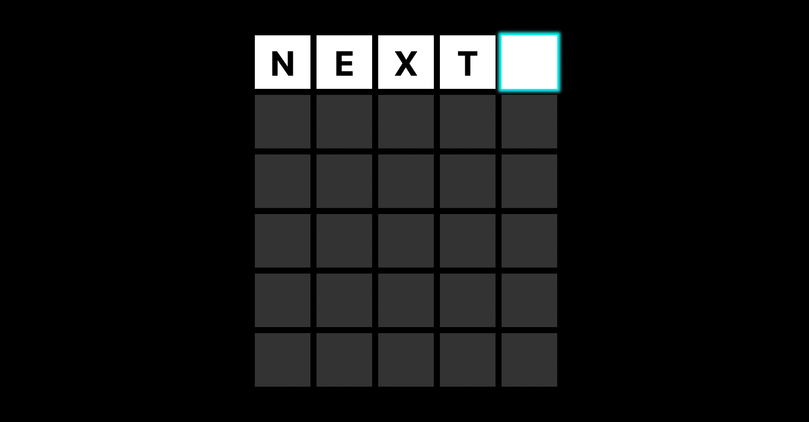

## Worldledge

An implementation of [Wordle](https://www.powerlanguage.co.uk/wordle/) to help
you learn Next.js and Vercel.



### Development

First, run the development server:

```bash
npm run dev
# or
yarn dev
```

Open [http://localhost:3000](http://localhost:3000) with your browser to see the result.

### Edge

In [`pages/middleware.ts`](pages/_middleware.ts) we implement the `/check` endpoint which gets deployed to all Vercel
regions automatically and has no cold boots. Any time you submit, we make a query against `/check`.

Users get automatically routed to the nearest region. Read more about [Edge Functions](https://vercel.com/edge).

_Note: Soon, for ergonomic reasons, Next.js will help you run `api/check` as an Edge Function as well._

## Credits & License

- Credits to Josh Wardle for [Wordle](https://www.powerlanguage.co.uk/wordle/)
- Licensed under MIT
